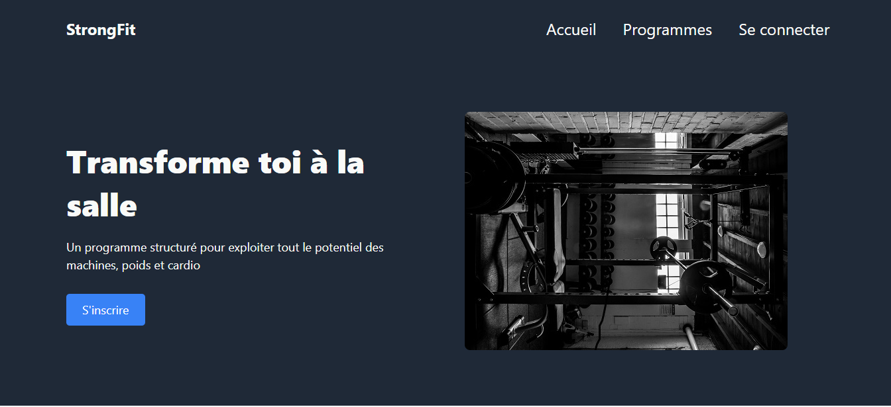

# odin-landing-page

Live Demo: <a href="https://Dee04Jeen.github.io/odin-landing-page/" target="blank_">Landing page</a>

PC View:

## Overview

This assignment <a href="https://www.theodinproject.com/lessons/foundations-landing-page" target="blank_">Project: Landing page</a> was set as part of the<a href="https://www.theodinproject.com/"> The Odin Project</a> curriculum. 

## Provided Assets

- Photos: <a href="https://unsplash.com/fr">unsplash.com</a>
1. <a href="https://unsplash.com/fr/@gettyimages"> Getty images</a>
2. <a href= "https://unsplash.com/fr/@scottwebb"> Scott Webb </a>
3. <a href="https://unsplash.com/fr/@brett_jordan"> Brett Jordan </a>

## Skills learnt 
- Flexbox 

